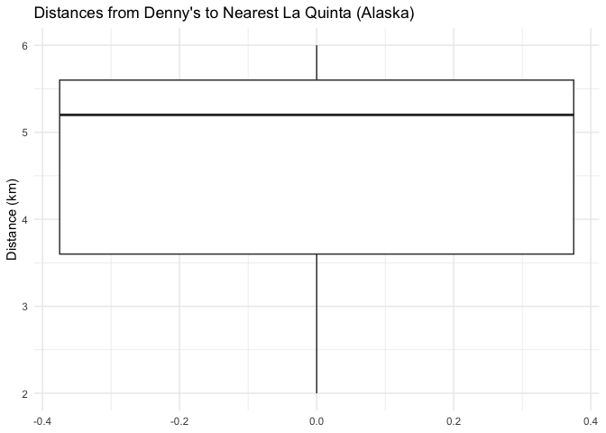
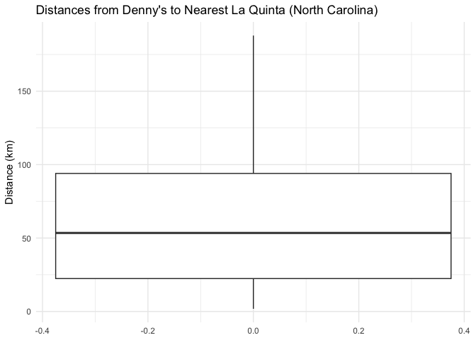
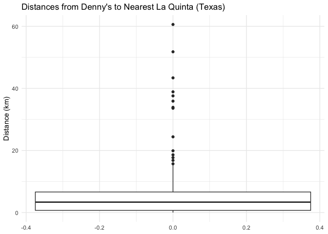
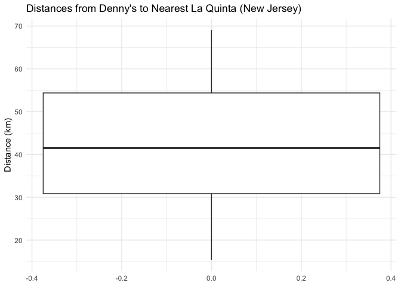

Lab 05 - Wrangling Spatial Data
================
Anahatt Virk
06/28/25

### Load packages and data

``` r
library(tidyverse) 
library(dsbox) 
```

``` r
states <- read_csv("data/states.csv")
```

### Exercise 1

``` r
dn_ak <- dennys %>%
  filter(state == "AK")
  nrow(dn_ak)
```

    ## [1] 3

There are 3 Denny’s locations in Alaska.

``` r
lq_ak <- laquinta %>%
  filter(state == "AK")
  nrow(lq_ak)
```

    ## [1] 2

There are 2 La Quinta hotels in Alaska.

### Exercise 2

``` r
num_dennys <- nrow(dn_ak)
num_lq <- nrow(lq_ak)

num_pairings <- num_dennys * num_lq
```

There are 6 distances that we need to calculate.

### Exercise 3

``` r
dn_lq_ak <- full_join(dn_ak, lq_ak, by = "state")
```

    ## Warning in full_join(dn_ak, lq_ak, by = "state"): Detected an unexpected many-to-many relationship between `x` and `y`.
    ## ℹ Row 1 of `x` matches multiple rows in `y`.
    ## ℹ Row 1 of `y` matches multiple rows in `x`.
    ## ℹ If a many-to-many relationship is expected, set `relationship =
    ##   "many-to-many"` to silence this warning.

``` r
dn_lq_ak
```

    ## # A tibble: 6 × 11
    ##   address.x     city.x state zip.x longitude.x latitude.x address.y city.y zip.y
    ##   <chr>         <chr>  <chr> <chr>       <dbl>      <dbl> <chr>     <chr>  <chr>
    ## 1 2900 Denali   Ancho… AK    99503       -150.       61.2 3501 Min… "\nAn… 99503
    ## 2 2900 Denali   Ancho… AK    99503       -150.       61.2 4920 Dal… "\nFa… 99709
    ## 3 3850 Debarr … Ancho… AK    99508       -150.       61.2 3501 Min… "\nAn… 99503
    ## 4 3850 Debarr … Ancho… AK    99508       -150.       61.2 4920 Dal… "\nFa… 99709
    ## 5 1929 Airport… Fairb… AK    99701       -148.       64.8 3501 Min… "\nAn… 99503
    ## 6 1929 Airport… Fairb… AK    99701       -148.       64.8 4920 Dal… "\nFa… 99709
    ## # ℹ 2 more variables: longitude.y <dbl>, latitude.y <dbl>

### Exercise 4

In the joined data frame there are 6 total observations. The variables
include address, city, state, zip code, longitude, and latitude. Each of
these variables repeats twice as .x and .y, one coming from the Denny’s
dataset, and the other coming from the La Quinta dataset. However, the
state variable only appears once as it was the join key.

### Exercise 5

``` r
haversine <- function(long1, lat1, long2, lat2, round = 3) {
  # convert to radians
  long1 <- long1 * pi / 180
  lat1 <- lat1 * pi / 180
  long2 <- long2 * pi / 180
  lat2 <- lat2 * pi / 180

R <- 6371 # Earth mean radius in km

a <- sin((lat2 - lat1) / 2)^2 + cos(lat1) * cos(lat2) * sin((long2 - long1) / 2)^2
d <- R * 2 * asin(sqrt(a))

return(round(d, round)) # distance in km
}
```

### Exercise 6

``` r
dn_lq_ak <- dn_lq_ak %>%
  mutate(distance = haversine(
    long1 = longitude.x,
    lat1 = latitude.x,
    long2 = longitude.y,
    lat2 = latitude.y,
    round = 1))
```

### Exercise 7

``` r
dn_lq_ak_mindist <- dn_lq_ak %>%
  group_by(address.x) %>%
  summarize(closest = min(distance))

dn_lq_ak_mindist
```

    ## # A tibble: 3 × 2
    ##   address.x        closest
    ##   <chr>              <dbl>
    ## 1 1929 Airport Way     5.2
    ## 2 2900 Denali          2  
    ## 3 3850 Debarr Road     6

### Exercise 8

``` r
summary(dn_lq_ak_mindist)
```

    ##   address.x            closest   
    ##  Length:3           Min.   :2.0  
    ##  Class :character   1st Qu.:3.6  
    ##  Mode  :character   Median :5.2  
    ##                     Mean   :4.4  
    ##                     3rd Qu.:5.6  
    ##                     Max.   :6.0

``` r
ggplot(dn_lq_ak_mindist, aes(y = closest)) +
  geom_boxplot() + 
  labs(title = "Distances from Denny's to Nearest La Quinta (Alaska)", y = "Distance (km)") + 
  theme_minimal()
```

<!-- -->

``` r
ggsave("dennys_la_quinta_distances.png")
```

    ## Saving 7 x 5 in image

The distances from Denny’s to their nearest La Quinta locations in
Alaska range from 2 km to 6 km, with an average of 4.4 km. The median
distance is 5.2 km.

### Exercise 9

``` r
dn_nc <- dennys %>%
  filter(state == "NC")
  nrow(dn_nc)
```

    ## [1] 28

There are 28 Denny’s locations in North Carolina.

``` r
lq_nc <- laquinta %>%
  filter(state == "NC")
  nrow(lq_nc)
```

    ## [1] 12

There are 12 La Quinta hotels in North Carolina.

``` r
num_dennys_nc <- nrow(dn_nc)
num_lq_nc <- nrow(lq_nc)

num_pairings_nc <- num_dennys_nc * num_lq_nc
```

There are 336 distances that we need to calculate.

``` r
dn_lq_nc <- full_join(dn_nc, lq_nc, by = "state")
```

    ## Warning in full_join(dn_nc, lq_nc, by = "state"): Detected an unexpected many-to-many relationship between `x` and `y`.
    ## ℹ Row 1 of `x` matches multiple rows in `y`.
    ## ℹ Row 1 of `y` matches multiple rows in `x`.
    ## ℹ If a many-to-many relationship is expected, set `relationship =
    ##   "many-to-many"` to silence this warning.

``` r
dn_lq_nc
```

    ## # A tibble: 336 × 11
    ##    address.x    city.x state zip.x longitude.x latitude.x address.y city.y zip.y
    ##    <chr>        <chr>  <chr> <chr>       <dbl>      <dbl> <chr>     <chr>  <chr>
    ##  1 1 Regent Pa… Ashev… NC    28806       -82.6       35.6 165 Hwy … "\nBo… 28607
    ##  2 1 Regent Pa… Ashev… NC    28806       -82.6       35.6 3127 Slo… "\nCh… 28208
    ##  3 1 Regent Pa… Ashev… NC    28806       -82.6       35.6 4900 Sou… "\nCh… 28217
    ##  4 1 Regent Pa… Ashev… NC    28806       -82.6       35.6 4414 Dur… "\nDu… 27707
    ##  5 1 Regent Pa… Ashev… NC    28806       -82.6       35.6 1910 Wes… "\nDu… 27713
    ##  6 1 Regent Pa… Ashev… NC    28806       -82.6       35.6 1201 Lan… "\nGr… 27407
    ##  7 1 Regent Pa… Ashev… NC    28806       -82.6       35.6 1607 Fai… "\nCo… 28613
    ##  8 1 Regent Pa… Ashev… NC    28806       -82.6       35.6 191 Cres… "\nCa… 27518
    ##  9 1 Regent Pa… Ashev… NC    28806       -82.6       35.6 2211 Sum… "\nRa… 27612
    ## 10 1 Regent Pa… Ashev… NC    28806       -82.6       35.6 1001 Aer… "\nMo… 27560
    ## # ℹ 326 more rows
    ## # ℹ 2 more variables: longitude.y <dbl>, latitude.y <dbl>

``` r
dn_lq_nc <- dn_lq_nc %>%
  mutate(distance = haversine(
    long1 = longitude.x,
    lat1 = latitude.x,
    long2 = longitude.y,
    lat2 = latitude.y,
    round = 1))
```

``` r
dn_lq_nc_mindist <- dn_lq_nc %>%
  group_by(address.x) %>%
  summarize(closest = min(distance))

dn_lq_nc_mindist
```

    ## # A tibble: 28 × 2
    ##    address.x                 closest
    ##    <chr>                       <dbl>
    ##  1 1 Regent Park Boulevard     108. 
    ##  2 101 Wintergreen Dr          120. 
    ##  3 103 Sedgehill Dr             26.7
    ##  4 1043 Jimmie Kerr Road        36.1
    ##  5 1201 S College Road         188. 
    ##  6 1209 Burkemount Avenue       39.1
    ##  7 1493 Us Hwy 74-A Bypass      70.1
    ##  8 1524 Dabney Dr               59.5
    ##  9 1550 Four Seasons           115. 
    ## 10 1800 Princeton-Kenly Road    55.9
    ## # ℹ 18 more rows

``` r
summary(dn_lq_nc_mindist)
```

    ##   address.x            closest      
    ##  Length:28          Min.   :  1.80  
    ##  Class :character   1st Qu.: 22.40  
    ##  Mode  :character   Median : 53.45  
    ##                     Mean   : 65.44  
    ##                     3rd Qu.: 94.00  
    ##                     Max.   :187.90

``` r
ggplot(dn_lq_nc_mindist, aes(y = closest)) +
  geom_boxplot() + 
  labs(title = "Distances from Denny's to Nearest La Quinta (North Carolina)", y = "Distance (km)")+
  theme_minimal()
```

<!-- -->

``` r
ggsave("dennys_nc_distances.png")
```

    ## Saving 7 x 5 in image

The distances from Denny’s to their nearest La Quinta locations in North
Carolina range from 1.8 km to 187.9 km, with an average of 65.44 km. The
median distance is 53.45 km.

### Exercise 10

``` r
dn_tx <- dennys %>%
  filter(state == "TX")
  nrow(dn_tx)
```

    ## [1] 200

There are 200 Denny’s locations in Texas.

``` r
lq_tx <- laquinta %>%
  filter(state == "TX")
  nrow(lq_tx)
```

    ## [1] 237

There are 237 La Quinta hotels in Texas.

``` r
num_dennys_tx <- nrow(dn_tx)
num_lq_tx <- nrow(lq_tx)

num_pairings_tx <- num_dennys_tx * num_lq_tx
```

There are 47400 distances that we need to calculate.

``` r
dn_lq_tx <- full_join(dn_tx, lq_tx, by = "state")
```

    ## Warning in full_join(dn_tx, lq_tx, by = "state"): Detected an unexpected many-to-many relationship between `x` and `y`.
    ## ℹ Row 1 of `x` matches multiple rows in `y`.
    ## ℹ Row 1 of `y` matches multiple rows in `x`.
    ## ℹ If a many-to-many relationship is expected, set `relationship =
    ##   "many-to-many"` to silence this warning.

``` r
dn_lq_tx
```

    ## # A tibble: 47,400 × 11
    ##    address.x    city.x state zip.x longitude.x latitude.x address.y city.y zip.y
    ##    <chr>        <chr>  <chr> <chr>       <dbl>      <dbl> <chr>     <chr>  <chr>
    ##  1 120 East I-… Abile… TX    79601       -99.6       32.4 3018 Cat… "\nAb… 79606
    ##  2 120 East I-… Abile… TX    79601       -99.6       32.4 3501 Wes… "\nAb… 79601
    ##  3 120 East I-… Abile… TX    79601       -99.6       32.4 14925 La… "\nAd… 75254
    ##  4 120 East I-… Abile… TX    79601       -99.6       32.4 909 East… "\nAl… 78516
    ##  5 120 East I-… Abile… TX    79601       -99.6       32.4 2400 Eas… "\nAl… 78332
    ##  6 120 East I-… Abile… TX    79601       -99.6       32.4 1220 Nor… "\nAl… 75013
    ##  7 120 East I-… Abile… TX    79601       -99.6       32.4 1165 Hwy… "\nAl… 76009
    ##  8 120 East I-… Abile… TX    79601       -99.6       32.4 880 Sout… "\nAl… 77511
    ##  9 120 East I-… Abile… TX    79601       -99.6       32.4 1708 Int… "\nAm… 79103
    ## 10 120 East I-… Abile… TX    79601       -99.6       32.4 9305 Eas… "\nAm… 79118
    ## # ℹ 47,390 more rows
    ## # ℹ 2 more variables: longitude.y <dbl>, latitude.y <dbl>

``` r
dn_lq_tx <- dn_lq_tx %>%
  mutate(distance = haversine(
    long1 = longitude.x,
    lat1 = latitude.x,
    long2 = longitude.y,
    lat2 = latitude.y,
    round = 1))
```

``` r
dn_lq_tx_mindist <- dn_lq_tx %>%
  group_by(address.x) %>%
  summarize(closest = min(distance))

dn_lq_tx_mindist
```

    ## # A tibble: 200 × 2
    ##    address.x             closest
    ##    <chr>                   <dbl>
    ##  1 100 Cottonwood           33.6
    ##  2 100 E Pinehurst           1.4
    ##  3 100 Us Highway 79 S      33.9
    ##  4 101 N Fm 707             10.3
    ##  5 1011 Beltway Parkway     14  
    ##  6 1015 Spur 350 West        1.7
    ##  7 1015 West Main St         1.1
    ##  8 10367 Highway 59         37.6
    ##  9 10433 N Central Expwy     0.6
    ## 10 105 W 42nd St             6.9
    ## # ℹ 190 more rows

``` r
summary(dn_lq_tx_mindist)
```

    ##   address.x            closest      
    ##  Length:200         Min.   : 0.000  
    ##  Class :character   1st Qu.: 0.700  
    ##  Mode  :character   Median : 3.350  
    ##                     Mean   : 5.792  
    ##                     3rd Qu.: 6.625  
    ##                     Max.   :60.600

``` r
ggplot(dn_lq_tx_mindist, aes(y = closest)) +
  geom_boxplot() + 
  labs(title = "Distances from Denny's to Nearest La Quinta (Texas)", y = "Distance (km)")+
  theme_minimal()
```

<!-- -->

``` r
ggsave("dennys_tx_distances.png")
```

    ## Saving 7 x 5 in image

The distances from Denny’s to their nearest La Quinta locations in Texas
range from 0.0 km to 60.6 km, with an average of 5.8 km. The median
distance is 3.4 km.

### Exercise 11

``` r
dn_nj <- dennys %>%
  filter(state == "NJ")
  nrow(dn_nj)
```

    ## [1] 10

There are 10 Denny’s locations in New Jersey.

``` r
lq_nj <- laquinta %>%
  filter(state == "NJ")
  nrow(lq_nj)
```

    ## [1] 5

There are 5 La Quinta hotels in New Jersey.

``` r
num_dennys_nj <- nrow(dn_nj)
num_lq_nj <- nrow(lq_nj)

num_pairings_nj <- num_dennys_nj * num_lq_nj
```

There are 50 distances that we need to calculate.

``` r
dn_lq_nj <- full_join(dn_nj, lq_nj, by = "state", relationship = "many-to-many")

dn_lq_nj
```

    ## # A tibble: 50 × 11
    ##    address.x    city.x state zip.x longitude.x latitude.x address.y city.y zip.y
    ##    <chr>        <chr>  <chr> <chr>       <dbl>      <dbl> <chr>     <chr>  <chr>
    ##  1 1286 St Geo… Avenel NJ    07001       -74.3       40.6 265 Rte … "\nCl… 07014
    ##  2 1286 St Geo… Avenel NJ    07001       -74.3       40.6 38 Two B… "\nFa… 07004
    ##  3 1286 St Geo… Avenel NJ    07001       -74.3       40.6 5000 Clo… "\nMo… 08054
    ##  4 1286 St Geo… Avenel NJ    07001       -74.3       40.6 350 Ligh… "\nSe… 07094
    ##  5 1286 St Geo… Avenel NJ    07001       -74.3       40.6 109 Rout… "\nWe… 07764
    ##  6 221 Us Hwy … Borde… NJ    08505       -74.7       40.1 265 Rte … "\nCl… 07014
    ##  7 221 Us Hwy … Borde… NJ    08505       -74.7       40.1 38 Two B… "\nFa… 07004
    ##  8 221 Us Hwy … Borde… NJ    08505       -74.7       40.1 5000 Clo… "\nMo… 08054
    ##  9 221 Us Hwy … Borde… NJ    08505       -74.7       40.1 350 Ligh… "\nSe… 07094
    ## 10 221 Us Hwy … Borde… NJ    08505       -74.7       40.1 109 Rout… "\nWe… 07764
    ## # ℹ 40 more rows
    ## # ℹ 2 more variables: longitude.y <dbl>, latitude.y <dbl>

``` r
dn_lq_nj <- dn_lq_nj %>%
  mutate(distance = haversine(
    long1 = longitude.x,
    lat1 = latitude.x,
    long2 = longitude.y,
    lat2 = latitude.y,
    round = 1))
```

``` r
dn_lq_nj_mindist <- dn_lq_nj %>%
  group_by(address.x) %>%
  summarize(closest = min(distance))

dn_lq_nj_mindist
```

    ## # A tibble: 10 × 2
    ##    address.x                   closest
    ##    <chr>                         <dbl>
    ##  1 1001 W Landis Ave              49.4
    ##  2 1286 St Georges Ave            30.3
    ##  3 1410 Blackwood Clementon Rd    15.4
    ##  4 221 Us Hwy 130                 32.5
    ##  5 242 E White Horse Pike         64.8
    ##  6 326 Slapes Corner Road         52.5
    ##  7 335 Tilton Rd                  69.1
    ##  8 3513 S Delsea Dr               55  
    ##  9 5550 Route 42                  20.2
    ## 10 752 Hwy #18                    33.6

``` r
summary(dn_lq_nj_mindist)
```

    ##   address.x            closest     
    ##  Length:10          Min.   :15.40  
    ##  Class :character   1st Qu.:30.85  
    ##  Mode  :character   Median :41.50  
    ##                     Mean   :42.28  
    ##                     3rd Qu.:54.38  
    ##                     Max.   :69.10

``` r
ggplot(dn_lq_nj_mindist, aes(y = closest)) +
  geom_boxplot() + 
  labs(title = "Distances from Denny's to Nearest La Quinta (New Jersey)", y = "Distance (km)")+
  theme_minimal()
```

<!-- -->

``` r
ggsave("dennys_n=j_distances.png")
```

    ## Saving 7 x 5 in image

The distances from Denny’s to their nearest La Quinta locations in New
Jersey range from 15.4 km to 69.1 km, with an average of 42.3 km. The
median distance is 41.5 km.

### Exercise 12

Among the states examined, Mitch Hedberg’s joke is most likely to hold
true in Texas. Texas has the highest number of both Denny’s and La
Quinta locations, and their locations are extremely close. The lowest
distance between them is 0.0 km, and the mean distance is 5.8 km,
reflecting their close proximity to one another in Texas. While the
greatest distance is 60.6 km, the low median and mean suggest that this
is likely an outlier.
